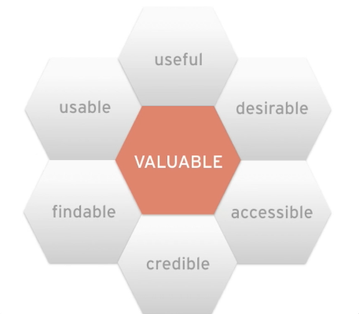
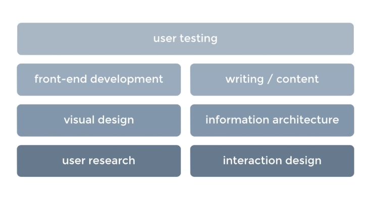
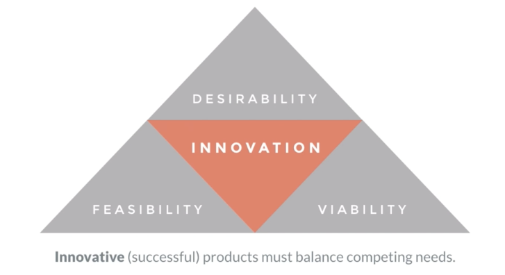

# What UXD is?

## Formal definition of UXD

> User experience design (UXD or UED) is the process of enhancing user satisfaction by improving the usability, accessibility, and pleasure provided in the interaction between the user and the product.

## UXD is sum of a simple equation

Business Goals + User/Customer Goals + User Interface + Back End Processes = **User Experience Design**

## UXD is the sum of these attributes

### UX Honey Comb

## UXD is the result of multiple activities

## UXD meanns problem solving

UXD explores feasible solution to design problems

- It uncovers users needs and business goals and aligns them by using a variety of research techniques.

- It creates a design that solves the problem by using a variety of design techniques.

- It ensures product meet or exceed user expectations, increase user satisfaction, and meet business goals.

- It determines the feasibility of high quality products that can be created and implemented.

## UXD ensures people using things

Because we use things when:

- We can easily figure out how to accomplish our tasks.

- The steps involved in accomplishing the tasks - no matter how complex - are logical and make sense.

- Our sense of effort and cognitive load are minimaized.

- Immediiate, clear feedback is provided for interactions, and we are confident that we are making progress.

- Our potential for error is minimized and when we do make a mistake, we can recover easily.

## UXD is a balancing act

## UXD is not UI design

UXD is not UI design, but UI design is part of UXD. UXD is a process that involves many different disciplines, including UI design, information architecture, interaction design, visual design, usability, and human-computer interaction.